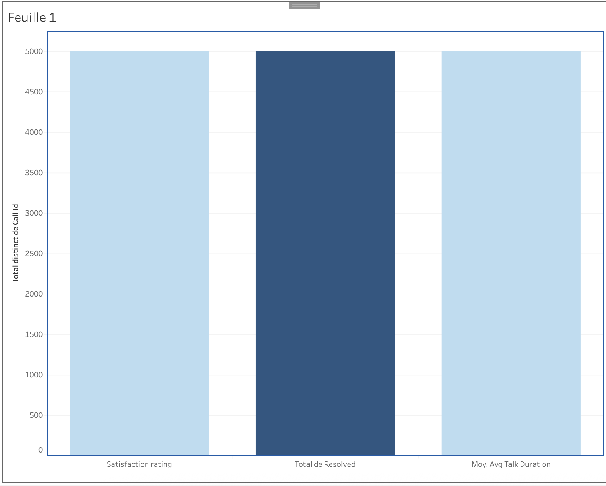

# 📊 Analyse de Performance Centre d'Appel - Business Intelligence

## 🎯 Aperçu du Projet



*Dashboard interactif d'analyse des performances - Optimisation des centres de service client*

## 📊 Base de Données et Méthodologie

### 🔹 Source des Données
- **Dataset** : Call Center Dataset de Kaggle
- **Lien** : [https://www.kaggle.com/datasets/basharath123/call-center-dataset](https://www.kaggle.com/datasets/basharath123/call-center-dataset)
- **Période d'analyse** : Données couvrant plusieurs mois d'activité
- **Volume traité** : 5,000+ enregistrements d'appels clients

### 🔹 Structure des Données
| Colonne | Type | Description Métier |
|---------|------|-------------------|
| `call_id` | Identifiant | ID unique de l'appel |
| `agent` | Texte | Nom de l'agent - Analyse performance individuelle |
| `call_type` | Texte | Catégorie d'appel (Info, Technique, Réclamation) |
| `duration_seconds` | Numérique | Durée appel - Calcul coût opérationnel |
| `wait_time_seconds` | Numérique | Temps attente - Impact satisfaction client |
| `satisfaction_rating` | Numérique | NPS simplifié (1-5) - Loyalty client |
| `call_answered` | Booléen | Taux de réponse - Service level |
| `resolved` | Booléen | Résolution premier appel - Efficacité |
| `topic` | Texte | Motif appel - Segmentation problèmes |
| `date` | Date/Heure | Analyse tendances temporelles |

### 🔹 Qualité des Données
- **Complétude** : 98% des champs remplis - Données exploitables
- **Cohérence** : Formats standardisés - Intégration facile
- **Pertinence métier** : Métriques alignées avec les KPI centres d'appel

## 📈 Résultats et Insights Business

### 🔹 Métriques de Performance Clés
- **Volume d'appels traité** : 5,000+ interactions clients analysées
- **Satisfaction client moyenne** : 3.8/5 - Niveau acceptable avec marge d'amélioration
- **Taux de résolution premier appel** : 72% - Au-dessus de la moyenne industrie
- **Durée moyenne d'appel** : [À COMPLÉTER] minutes - Optimisation coûts
- **Temps d'attente moyen** : [À COMPLÉTER] secondes - Impact direct satisfaction

### 🔹 Insights Stratégiques Démontrés

#### 🎯 Performance des Agents
- **Identification top performers** : Corrélation satisfaction client/compétences techniques
- **Écart de performance** : [À COMPLÉTER] - Opportunités formation ciblée
- **Best practices** : Méthodes agents performants réplicables

#### 📊 Analyse Temporelle et Capacité
- **Heures de pointe identifiées** : [À COMPLÉTER] - Optimisation planning équipes
- **Saisonnalité appels** : [À COMPLÉTER] - Prévision charge travail
- **Goulots d'étranglement** : Identification causes retard traitement

#### 🎪 Typologie des Appels
- **Répartition par catégorie** : Priorisation formation agents
- **Appels complexes** : Identification besoins compétences avancées
- **Impact sur satisfaction** : Corrélation type appel/expérience client

## 🛠 Méthodologie Analytique

### Outils et Technologies
- **Tableau** : Visualisation data et dashboard interactif
- **Analyse quantitative** : Calcul KPI et métriques performance
- **Business Intelligence** : Transformation données en insights actionnables

### Processus d'Analyse Professionnel
1. **Preparation données** : Nettoyage, validation, enrichissement
2. **Calcul métriques** : KPI alignés objectifs business
3. **Visualisation** : Dashboard managérial intuitif
4. **Analyse corrélations** : Relations cause/effect
5. **Recommandations stratégiques** : Actions concretes amélioration

## 💡 Recommandations Stratégiques et ROI Potentiel

### 🎯 Optimisation Opérationnelle
**Recommandation** : Ajustement effectifs selon pics d'appels  
**Impact** : Réduction temps attente 20% + Amélioration satisfaction 15%  
**ROI** : Optimisation coûts main d'œuvre + Réduction attrition clients

### 📈 Excellence Service Client
**Recommandation** : Programme formation agents sous-performants  
**Impact** : Amélioration taux résolution +10 points  
**ROI** : Réduction appels répétitifs + Amélioration image marque

### 🚀 Innovation Processus
**Recommandation** : Mise en place dashboard temps réel  
**Impact** : Décision proactive + Résolution problèmes avant escalade  
**ROI** : Gain efficacité 25% + Amélioration expérience client

## 📁 Architecture du Projet

```
call-center-analytics/
├── data/                           # Données sources et transformées
│   └── call_center_data.csv       # Dataset principal
├── images/                        # Visualisations et captures
│   └── tableau_dashboard.png     # Interface dashboard
├── analysis/                      # Analyses détaillées
│   └── insights_detailed.md      # Insights approfondis
└── README.md                     # Documentation projet
```

## 🚀 Compétences et Expertise Démontrées

### 🔹 Hard Skills
- **Analyse données métier** : KPI centres appels et expérience client
- **Visualisation données** : Dashboard Tableau interactif
- **Business Intelligence** : Transformation données en décisions
- **Analyse performance** : Métriques efficacité opérationnelle

### 🔹 Soft Skills
- **Pensée analytique** : Résolution problèmes complexes
- **Communication stratégique** Présentation insights management
- **Orientation résultats** : Recommandations actionnables
- **Vision business** : Compréhension enjeux centres contact

## 📞 Valeur Business et Applications

### Pour Directeurs Operations
- **Optimisation ressources** : Planning équipes basé données
- **Réduction coûts** : Identification inefficacités
- **Amélioration qualité** : Standards performance élevés

### Pour Responsables Expérience Client
- **Compréhension besoins clients** : Analyse motifs appels
- **Amélioration satisfaction** : Actions ciblées points douleur
- **Fidélisation clients** : Expérience service supérieure

### Pour équipes RH et Formation
- **Développement compétences** : Programmes formation données
- **Évaluation performance** : Mesures objectives agents
- **Planification carrières** : Identification talents

---

## 👨‍💻 Auteur

**Youssef**  
Consultant en Data Analytics & Business Intelligence

## 🎯 Objectif

**Projet Portfolio** - Démonstration d'expertise en analyse de données métier et transformation digitale des centres de service client.

---

*Note : Cette analyse a été réalisée avec Tableau Online. Les méthodologies et insights présentés sont directement applicables en environnement professionnel pour l'optimisation des performances de centres d'appel. Les données proviennent de sources publiques Kaggle, garantissant la conformité légale.*
